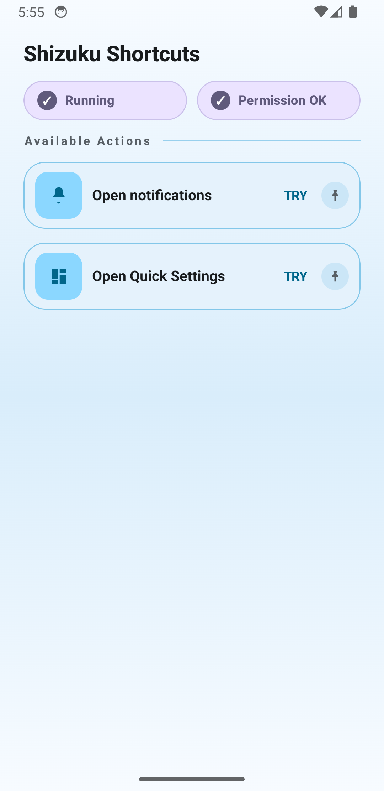
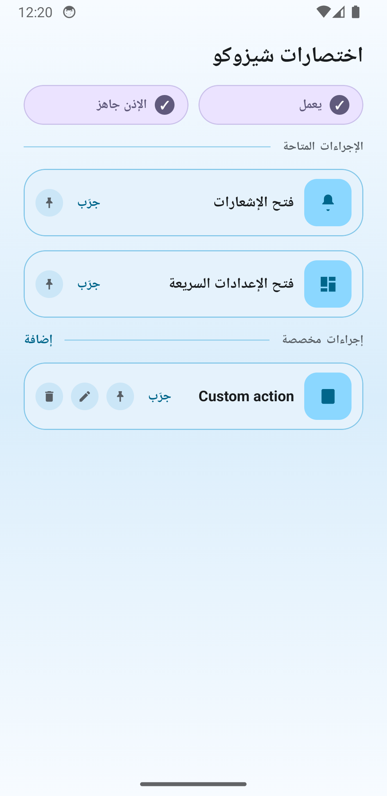

# Shizuku Shortcuts

[](https://developer.android.com/)
[](https://kotlinlang.org/)
[](https://developer.android.com/jetpack/compose)
[](https://developer.android.com/about/versions/android-8.0)
[](https://github.com/RikkaApps/Shizuku)

Tiny launcher shortcuts, home-screen widgets, and custom shell actions for Android through Shizuku.

The app ships with two built-in actions:

- open notifications
- open Quick Settings

It can run them directly from the compact home screen with `Try`, pin them as launcher shortcuts with `Pin`, place them as home-screen widgets, and add local custom shell actions such as `cmd statusbar expand-notifications` without the `adb shell` prefix.

> [!CAUTION]
> This project was developed with heavy use of AI assistance, including OpenAI Codex.

## Screenshots

<table>
  <thead>
    <tr>
      <th align="left">English</th>
      <th align="left">Arabic (RTL)</th>
    </tr>
  </thead>
  <tbody>
    <tr>
      <td>
        <div><strong>Home</strong> (actions + status)</div>
        
      </td>
      <td>
        <div><strong>Home</strong> (الصفحة الرئيسية)</div>
        
      </td>
    </tr>
  </tbody>
</table>

## What This App Does

- Opens the notification shade with `cmd statusbar expand-notifications`
- Opens Quick Settings with `cmd statusbar expand-settings`
- Falls back to `service call statusbar 1` for notifications on older ROMs when needed
- Lets you add local custom shell actions that run through the same Shizuku user-service path
- Keeps built-in static launcher shortcuts and publishes custom dynamic shortcuts to the launcher long-press menu
- Supports pinned launcher shortcuts for both built-ins and custom actions
- Supports a unified home-screen widget: each widget instance can be configured to one built-in or custom action
- Re-routes widget taps through `ShortcutDispatchActivity` and shows a rebind prompt if a linked custom action is removed
- Shows Shizuku state and permission state as compact status chips
- Lets you `Try`, `Edit`, `Pin`, or `Delete` custom actions from the home screen
- Supports Android dynamic colors on Android 12+ with a fixed fallback palette on older versions
- Supports English and Arabic with RTL
- Uses Android app language settings, not an in-app language picker

## Requirements

- Android `minSdk 26`
- Shizuku installed and running
- Shizuku permission granted to this app

## Architecture

Core pieces:

- `MainActivity`: condensed Compose home screen with status chips, inline guidance, and action rows
- `ShortcutDispatchActivity`: transparent trampoline for launcher shortcuts
- `AppShizukuManager`: binder state, permission flow, and user-service binding
- `PrivilegedStatusBarService`: Shizuku user service binder
- `AppCustomActionsRepository`: local custom-action persistence in one SharedPreferences JSON payload
- `ActionCatalog` and `DynamicShortcutSync`: merged lookup plus custom dynamic shortcut publishing
- `ActionPerformer`: shell command execution and fallback logic
- `ActionWidgetProvider`, `ActionWidgetConfigureActivity`, `ActionWidgetRenderer`, and `WidgetBindingsRepository`: widget lifecycle, selection UI, rendering, and per-widget action binding

Runtime flow:

1. User taps `Try` in the app, launches a static/dynamic/pinned shortcut, or taps a configured widget
2. The app checks Shizuku availability and permission
3. The app binds the Shizuku user service
4. The user service runs either the built-in argv command or `sh -c` for a custom shell action
5. The app returns silently or shows a short toast on failure

## Calling From Other Apps

Built-in actions can also be triggered by other apps such as Tasker because `ShortcutDispatchActivity` is exported.

Use an explicit intent to:

- package: `com.yshalsager.shizukushortcuts`
- class: `com.yshalsager.shizukushortcuts.ShortcutDispatchActivity`

Built-in actions support either the intent action or the `extra_action_id` extra.

Open notifications:

```bash
adb shell am start \
  -n com.yshalsager.shizukushortcuts/.ShortcutDispatchActivity \
  -a com.yshalsager.shizukushortcuts.action.EXPAND_NOTIFICATIONS
```

Open Quick Settings:

```bash
adb shell am start \
  -n com.yshalsager.shizukushortcuts/.ShortcutDispatchActivity \
  -a com.yshalsager.shizukushortcuts.action.EXPAND_QUICK_SETTINGS
```

You can also use the shared extra instead:

```bash
adb shell am start \
  -n com.yshalsager.shizukushortcuts/.ShortcutDispatchActivity \
  --es extra_action_id expand_notifications
```

Current built-in ids:

- `expand_notifications`
- `expand_quick_settings`

Notes:

- Shizuku still needs to be running and permission must already be granted
- custom actions are internally callable by id too, but there is no public API yet to list or stabilize those ids for Tasker-style integrations

Implementation details live in [docs/implementation-walkthrough.md](/Users/yshalsager/tmp/research/shizuku-shortcuts/docs/implementation-walkthrough.md).

## Build

This project uses [mise](https://mise.jdx.dev/) for tool management.

```bash
# Build debug APK
./gradlew :app:assembleDebug

# Run unit tests
./gradlew :app:testDebugUnitTest

# Build Android test APK
./gradlew :app:assembleDebugAndroidTest
```

## Fastlane And Metadata

This repo includes:

- `fastlane/metadata/android/en-US`
- `fastlane/metadata/android/ar`
- screenshot assets under `fastlane/metadata/android/*/images/phoneScreenshots`
- fastlane lanes for metadata validation, screenshot capture, and Play upload

Useful commands:

```bash
# Install fastlane
bundle install

# Validate fastlane metadata
bundle exec fastlane android validate_metadata

# Capture screenshots
bundle exec fastlane android capture_screenshots
```

## CI

GitHub Actions included in this repo:

- `ci.yml`: unit tests, debug build, release build, metadata validation
- `screenshots.yml`: emulator-based fastlane screenshot capture
- `release.yml`: build release APK and attach it to GitHub releases

## License

GPL-3.0-only. See [LICENSE](/Users/yshalsager/tmp/research/shizuku-shortcuts/LICENSE).
